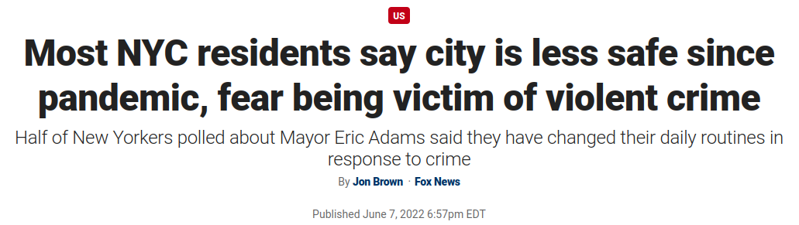
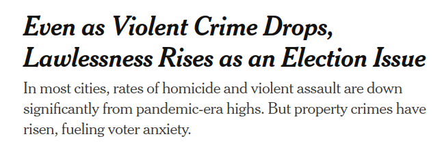

## "Crime is up since the pandemic"

<div class="notes">
- If you look at enough media coverage of crime in NYC since the pandemic, you start to get kinda confused about
what the outlook really is
- Conservative outlets tend to highlight the increase in crime since the pandemic
</div>

```{r header, message=FALSE, echo=FALSE}
library(tidyverse)
library(tidymodels)
library(modeltime)
library(sf)
library(leaflet)

NYPD_SHOOTING_URL <- "https://data.cityofnewyork.us/api/views/833y-fsy8/rows.csv?accessType=DOWNLOAD"
```

```{r data-import, message=FALSE, warning=FALSE, echo=FALSE}
shooting_raw_df <- 
    NYPD_SHOOTING_URL %>% 
    read_csv(
        col_types = cols(
            INCIDENT_KEY            = col_integer(),
            OCCUR_DATE              = col_date(format = "%m/%d/%Y"),
            OCCUR_TIME              = col_time(format = "%H:%M:%S"),
            PRECINCT                = col_integer(),
            JURISDICTION_CODE       = col_integer(),
            STATISTICAL_MURDER_FLAG = col_logical(),
            X_COORD_CD              = col_double(),
            Y_COORD_CD              = col_double(),
            Latitude                = col_double(),
            Longitude               = col_double(),
            .default                = col_character()
        )
    ) %>% 
    janitor::clean_names()
```

```{r data-cleaning-transformation, echo=FALSE, message=FALSE, warning=FALSE}
shooting_clean_df <- 
    shooting_raw_df %>% 
    mutate(
        occur_datetime = lubridate::make_datetime(
            year = year(occur_date),
            month = month(occur_date),
            day = day(occur_date),
            hour = hour(occur_time),
            min = minute(occur_time),
            sec = second(occur_time),
            tz = "America/New_York"
        ),
        boro = 
            boro %>% 
            as_factor(),
        across(
            ends_with("_age_group"),
            ~ coalesce(., "UNKNOWN") %>% 
                as_factor() %>% 
                fct_collapse(UNKNOWN = c("UNKNOWN", "(null)")) %>% 
                fct_relevel("<18", "18-24", "25-44", "45-64", "65+")
        ),
        across(
            c(ends_with("_sex"), ends_with("_race")),
            ~ coalesce(., "U") %>%
                as_factor() %>% 
                fct_collapse(U = c("U", "(null)"))
        )
    )
```

```{r election-results, echo=FALSE, message=FALSE, warning=FALSE}
nyc_borough_fips_codes <- c(
    "36061",  # Manhattan
    "36005",  # The Bronx
    "36047",  # Brooklyn
    "36081",  # Queens
    "36085"   # Staten Island
)

nyc_election_results <- 
    ## Downloaded from 
    ## https://int.nyt.com/newsgraphics/elections/map-data/2020/national/precincts-with-results.geojson.gz
    here::here("data/election-results.geojson") %>% 
    geojsonsf::geojson_sf() %>% 
    janitor::clean_names() %>% 
    mutate(fips_code = str_split_i(geoid, "-", 1)) %>% 
    filter(fips_code %in% nyc_borough_fips_codes)
```


{width=75%}
{width=75%}
{width=75%}

## "Crime is down in NYC"

<div class="notes">
- Liberal outlets have recently said that crime is down
- There are differing incentives
    - NY and NYC politics are dominated by Democrats/liberals, they want to make their policy-making look good
    - Republicans/conservatives want to make the situation look bad to attack Democratic policy-making
</div>

{width=75%}
{width=75%}
{width=75%}
    
# What does the data say?

<div class="notes">
- I wanted to know what do the data say
    - Was there a big spike in crime post-pandemic?
    - What are crime rates like compared with pre-pandemic levels?
</div>

## Rates of shootings during the pandemic years

...but quickly fell to pre-pandemic levels.

```{r ts-model, echo=FALSE, message=FALSE, warning=FALSE}
shootings_monthly_df <- 
    shooting_clean_df %>% 
    mutate(occur_month = lubridate::floor_date(occur_datetime, unit = "month")) %>% 
    group_by(occur_month) %>% 
    summarize(num_incidents = n())

stl_model_spec <- 
    seasonal_reg(mode = "regression", seasonal_period_1 = "1 year") %>% 
    set_engine("stlm_arima")

stl_model_fit <- 
    stl_model_spec %>% 
    fit(num_incidents ~ occur_month, data = shootings_monthly_df)


shootings_monthly_df %>% 
    mutate(trend = stl_model_fit$fit$models$model_1$stl[,"Trend"] %>% as.numeric()) %>% 
    pivot_longer(cols = c(num_incidents, trend), names_to = "variable", values_to = "value") %>% 
    ggplot(aes(x = occur_month)) +
    geom_line(aes(y = value, color = variable)) +
    geom_hline(yintercept = 0, color = "white", linewidth = 1.5) +
    scale_x_datetime(breaks = breaks_width(width = "2 year"), labels = label_date(format = "%Y")) +
    scale_color_manual(
        name = NULL, 
        values = c("num_incidents" = "black", "trend" = "red"),
        labels = c("num_incidents" = "Observed", "trend" = "Seasonally Adj."),
    ) +
    labs(
        title = "Monthly Shooting Incidents in NYC",
        subtitle = "Shootings near 15-year low following a sharp rise during COVID"
    ) +
    xlab(NULL) +
    ylab("No. of Incidents") +
    theme(legend.position = "bottom")

```


## Crime is a local phenomenon

```{r neighborhood-map, echo=FALSE, message=FALSE, warning=FALSE}
sf_use_s2(FALSE)

shooting_sf <- 
    shooting_clean_df %>% 
    mutate(location_geo = purrr::map2(longitude, latitude, ~ st_point(x = c(.x, .y)))) %>% 
    st_as_sf() %>% 
    st_set_crs(4326)

shooting_precinct <- 
    nyc_election_results %>%
    st_join(
        shooting_sf,
        join = st_intersects
    ) %>% 
    as_tibble() %>% 
    select(incident_key, geoid, occur_datetime)
make_shooting_label <- function(diff) {
    str_glue("<br>Change in Shootings per Year: {round(diff, 2)}</br>")
}

shootings_2016_2019_by_precinct <- 
    shooting_precinct %>% 
    filter(year(occur_datetime) %in% 2016:2019) %>% 
    group_by(geoid) %>% 
    summarize(n_incidents_2016_2019 = sum(!is.na(incident_key)))
    
shootings_2020_2021_by_precinct <- 
    shooting_precinct %>% 
    filter(year(occur_datetime) %in% 2020:2021) %>% 
    group_by(geoid) %>% 
    summarize(n_incidents_2020_2021 = sum(!is.na(incident_key)))

shootings_diff_by_precinct <- 
    nyc_election_results %>% 
    as_tibble() %>% 
    left_join(shootings_2016_2019_by_precinct, by = "geoid") %>% 
    left_join(shootings_2020_2021_by_precinct, by = "geoid") %>% 
    mutate(
        across(starts_with("n_incidents"), ~ coalesce(., 0)),
        diff = n_incidents_2020_2021 / 2 - n_incidents_2016_2019 / 4
    ) 

neighborhoods <- 
    # Downloaded from https://data.cityofnewyork.us/City-Government/Neighborhood-Names-GIS/99bc-9p23
    here::here("data/neighborhood-boundaries.geojson") %>% 
    geojsonsf::geojson_sf() %>% 
    janitor::clean_names()

shooting_diff_by_neighborhood <- 
    neighborhoods %>% 
    st_join(shootings_diff_by_precinct %>% st_as_sf(), join = st_intersects) %>% 
    as_tibble() %>% 
    select(-votes_per_sqkm) %>% 
    group_by(ntacode, ntaname, geometry) %>% 
    summarize(
        across(c(starts_with("n_incidents"), starts_with("votes_")), sum)
    ) %>% 
    ungroup() %>% 
    mutate(
        diff = n_incidents_2020_2021 / 2 - n_incidents_2016_2019 / 4,
        pct_dem_lead = 100 * (votes_dem - votes_rep) / votes_total
    )

domain <- c(min(shooting_diff_by_neighborhood$diff), max(shooting_diff_by_neighborhood$diff))
lower_palette <- colorRampPalette(c("blue", "#eeeeff"), space = "Lab")(abs(domain[1]))
upper_palette <- colorRampPalette(c("#ffefef", "orange"), space = "Lab")(domain[2])
shooting_palette <- c(lower_palette, upper_palette)

make_neighborhood_label <- function(votes_dem, votes_rep, pct_dem_lead, name) {
    margin <- 
        if_else(
            pct_dem_lead >= 0, 
            str_glue("D+{round(pct_dem_lead, 1)}%"), 
            str_glue("R+{round(-pct_dem_lead, 1)}%")
        )
    style <- if_else(
        pct_dem_lead >= 0,
        "color:blue;",
        "color:red;"
    )
    str_glue("<h3>{name}</h3><p>Votes for Biden: {votes_dem}</p><p>Votes for Trump: {votes_rep}</p><p><b>Margin: <span style={style}>{margin}<span></b></p>")
}

shooting_diff_by_neighborhood %>% 
    sf::st_as_sf() %>% 
    leaflet() %>% 
    addTiles() %>% 
    addPolygons(    
        weight = 1,
        color = "black",
        fillColor = ~get('colorBin')(shooting_palette, domain)(diff), 
        fillOpacity = 0.5,
        label = ~map(make_neighborhood_label(votes_dem, votes_rep, pct_dem_lead, ntaname), htmltools::HTML)
    )
```

## Crime is an *extremely* local phenomenon

```{r precinct-shooting-map, echo=FALSE, message=FALSE, warning=FALSE}
precinct_shooting_map_data <- 
    shootings_diff_by_precinct %>% 
    left_join(nyc_election_results %>% select(geoid, geometry), by = "geoid") %>% 
    mutate(diff = coalesce(diff, 0)) 

domain <- c(min(precinct_shooting_map_data$diff), max(precinct_shooting_map_data$diff))
lower_palette <- colorRampPalette(c("blue", "#eeeeff"), space = "Lab")(abs(domain[1]))
upper_palette <- colorRampPalette(c("#ffefef", "orange"), space = "Lab")(domain[2])
shooting_palette <- c(lower_palette, upper_palette)

precinct_shooting_map_data %>% 
    st_as_sf() %>% 
    leaflet(options = leafletOptions(minZoom = 10)) %>% 
    addTiles() %>% 
    addPolygons(
        weight = 1, 
        color = ~get('colorBin')(shooting_palette, domain)(diff), 
        fillOpacity = 0.5,
        label = ~map(make_shooting_label(diff), htmltools::HTML)
    ) %>% 
    addLegend(position = "bottomright", pal = colorBin(shooting_palette, domain), values = domain)
```

# What do voters think?

## Were shooting rates correlated with voter preferences?

Different geographical grains tell different stories...

```{r neighborhood-plot, echo=FALSE, message=FALSE, warning=FALSE}
neighborhood_linear_model <- 
    linear_reg() %>% 
    fit(diff ~ pct_dem_lead, data = shooting_diff_by_neighborhood)

shooting_diff_by_neighborhood %>% 
    mutate(model_pred = predict(neighborhood_linear_model, new_data = shooting_diff_by_neighborhood)$.pred) %>% 
    ggplot(aes(pct_dem_lead)) +
    geom_hex(aes(y = diff)) +
    geom_hline(yintercept = 0, size = 1, color = "white") +
    geom_vline(xintercept = 0, size = 1, color = "white") +
    geom_line(aes(y = model_pred), color = "red", size = 0.5) +
    scale_fill_viridis_c(name = "# neighborhoods") +
    labs(
        title = "Change in Shootings/Yr from 2016-19 to 2020-21 vs. Dem. Margin by Neighborhood",
        subtitle = "Increased Dem Support Correlated with Increased Shootings",
        x = "Dem. Margin",
        y = "Shootings/Yr"
    ) +
    theme(
        legend.position = "bottom", 
        legend.key.height = unit(2, "mm"), 
        legend.key.width = unit(2, "cm"),
        legend.title.position = "bottom"
    )
```

## Were shooting rates correlated with voter preferences?

Different geographical grains tell different stories...

```{r precinct-shooting-plot, echo=FALSE, message=FALSE, warning=FALSE}

linear_model <- 
    linear_reg() %>% 
    fit(diff ~ pct_dem_lead, data = shootings_diff_by_precinct)

shootings_diff_by_precinct %>% 
    mutate(model_pred = predict(linear_model, new_data = shootings_diff_by_precinct)$.pred) %>% 
    ggplot(aes(pct_dem_lead)) +
    geom_hex(aes(y = diff)) +
    geom_hline(yintercept = 0, size = 1, color = "white") +
    geom_vline(xintercept = 0, size = 1, color = "white") +
    geom_line(aes(y = model_pred), color = "red", size = 0.5) +
    scale_fill_viridis_c(name = "# precincts") +
    labs(
        title = "Change in Shootings/Yr from 2016-19 to 2020-21 vs. Dem. Margin by Precinct",
        subtitle = "Virtually no correlation exists",
        x = "Dem. Margin",
        y = "Shootings/Yr"
    ) +
    theme(
        legend.position = "bottom", 
        legend.key.height = unit(2, "mm"), 
        legend.key.width = unit(2, "cm"),
        legend.title.position = "bottom"
    )
```


## In conclusion...

> - Shooting rates did spike during the pandemic in NYC and returned to pre-pandemic levels on aggregate
> - Shooting rate changes during the pandemic varied wildly within NYC, even from block to block
> - Difficult to say if or how violent crime rates influenced voter preferences in 2020

# Thanks!

